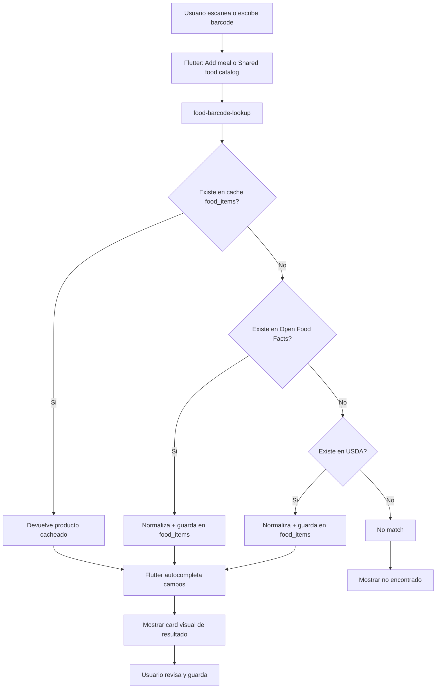
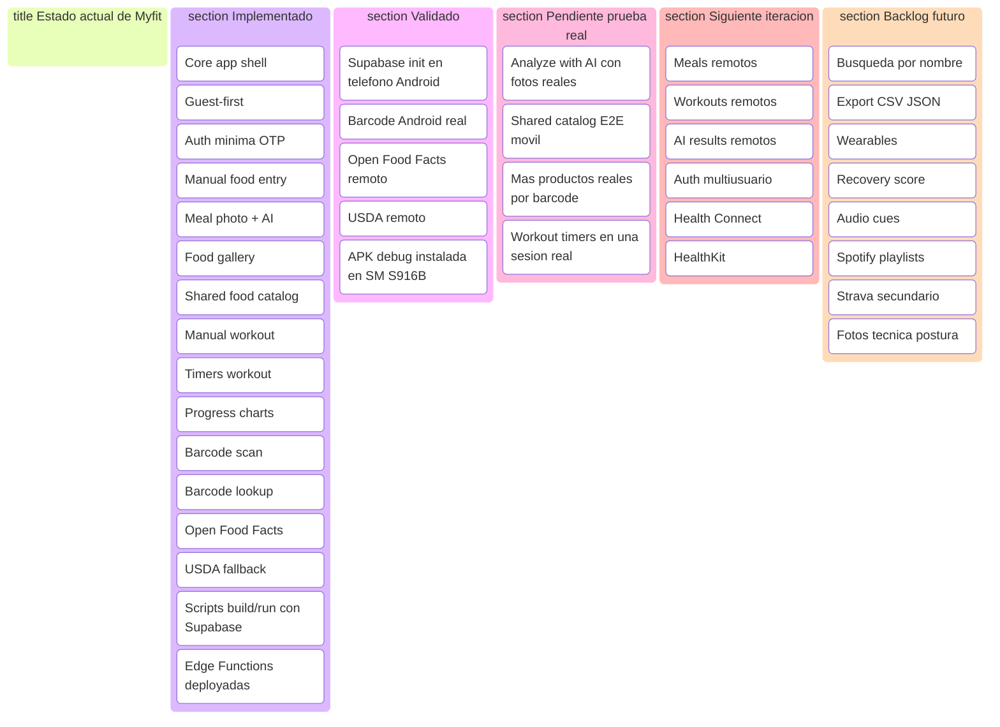

# Status Map Visual

## Objetivo

Este archivo deja una version visual local del estado de `Myfit` usando Mermaid.

Sirve para:

- entender rapido que ya existe,
- ver que partes ya fueron probadas en dispositivo,
- identificar lo pendiente de prueba real,
- ubicar la siguiente iteracion,
- y mostrar el backlog futuro sin mezclarlo con el core actual.

## Vista 1: Mapa de producto por modulos

```mermaid
flowchart LR
    subgraph APP[Myfit]
        CORE[Core app]
        AUTH[Auth]
        FOOD[Food]
        BARCODE[Barcode]
        WORKOUT[Workout]
        PROGRESS[Progress]
        BACKEND[Backend]
        NEXT[Next iteration]
        FUTURE[Future backlog]
    end

    subgraph DONE[Implementado]
        CORE1[Welcome / Onboarding / Dashboard]
        CORE2[EN / ESP + Dark mode + Top bar]

        AUTH1[Guest-first usable]
        AUTH2[Auth minima OTP]

        FOOD1[Manual food entry]
        FOOD2[Meal photo + AI]
        FOOD3[Food gallery]
        FOOD4[Shared food catalog]

        WORK1[Manual workout]
        WORK2[Sets reps peso RPE]
        WORK3[Repeat last + recientes]
        WORK4[Workout timer + Rest timer]

        PROG1[Resumen diario]
        PROG2[Targets]
        PROG3[Charts + fuerza + 1RM]

        BE1[meal-photo-analyze]
        BE2[food-catalog-upsert]
        BE3[food-barcode-lookup]
        BE4[OpenRouter activo]
    end

    subgraph REAL[Validado en dispositivo o remoto]
        BAR1[Scan barcode Android]
        BAR2[Lookup Open Food Facts]
        BAR3[Fallback USDA]
        BAR4[Supabase init en telefono]
        BAR5[Card visual de resultado]
    end

    subgraph PENDING_REAL[Pendiente de prueba real]
        PR1[Foto real + Analyze with AI]
        PR2[Mas productos reales por barcode]
        PR3[Shared catalog E2E en movil]
        PR4[Workout timers en sesion real]
    end

    subgraph UPCOMING[Pendiente siguiente iteracion]
        NX1[Meals remotos por usuario]
        NX2[Workouts remotos por usuario]
        NX3[AI results remotos]
        NX4[Auth multiusuario]
        NX5[Health Connect]
        NX6[HealthKit]
    end

    subgraph BACKLOG[Backlog futuro]
        FB1[Busqueda por nombre]
        FB2[Export CSV/JSON]
        FB3[Wearables]
        FB4[Recovery score]
        FB5[Audio cues]
        FB6[Spotify / playlists]
        FB7[Strava secundario]
        FB8[Fotos tecnica / postura]
    end

    CORE --> CORE1
    CORE --> CORE2

    AUTH --> AUTH1
    AUTH --> AUTH2

    FOOD --> FOOD1
    FOOD --> FOOD2
    FOOD --> FOOD3
    FOOD --> FOOD4

    BARCODE --> BAR1
    BARCODE --> BAR2
    BARCODE --> BAR3
    BARCODE --> BAR4
    BARCODE --> BAR5

    WORKOUT --> WORK1
    WORKOUT --> WORK2
    WORKOUT --> WORK3
    WORKOUT --> WORK4

    PROGRESS --> PROG1
    PROGRESS --> PROG2
    PROGRESS --> PROG3

    BACKEND --> BE1
    BACKEND --> BE2
    BACKEND --> BE3
    BACKEND --> BE4

    FOOD --> PR1
    BARCODE --> PR2
    FOOD --> PR3
    WORKOUT --> PR4

    AUTH --> NX4
    FOOD --> NX1
    WORKOUT --> NX2
    FOOD --> NX3
    PROGRESS --> NX5
    PROGRESS --> NX6

    FOOD --> FB1
    PROGRESS --> FB2
    PROGRESS --> FB3
    PROGRESS --> FB4
    WORKOUT --> FB5
    WORKOUT --> FB6
    PROGRESS --> FB7
    FOOD --> FB8
```

## Vista 2: Flujo de barcode nutricional

## Vista 3: Tablero por estado

## Como leer este archivo

- La `Vista 1` muestra el producto por modulos.
- La `Vista 2` muestra el flujo funcional mas nuevo y mas importante de esta iteracion: barcode nutricional.
- La `Vista 3` muestra el estado por columnas para una lectura rapida tipo roadmap.

## Fuente de verdad relacionada

- `docs/product/status_map.md`
- `docs/handoff/current_status.md`
- `docs/product/roadmap.md`
